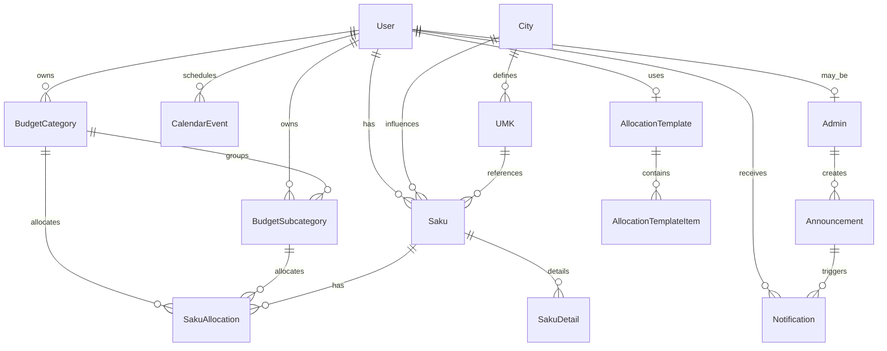

# FinanSaku — Database Schema Overview

This document provides a structured overview of the **FinanSaku PostgreSQL
database schema** managed by Prisma ORM.
It explains entity relationships, common calculations, and the purpose of each
core table.

---

## 1. ERD Diagram


**DrawSQL Links:**

- [FinanSaku v1](https://drawsql.app/teams/doa-1/diagrams/finansaku)
- [FinanSaku v2](https://drawsql.app/teams/doa-1/diagrams/finansaku2)

---

## 2. Core Structure

FinanSaku uses a **normalized relational schema**, where each table serves a
specific domain purpose.

| Category | Tables |
|-----------|---------|
| **User & Access** | `users`, `admins`, `notifications`, `notification_preferences` |
| **Location & Reference** | `cities`, `umk` |
| **Finance Core** | `saku`, `saku_allocations`, `saku_details` |
| **Budget System** | `budget_categories`, `budget_subcategories`, `allocation_templates`, `allocation_template_items` |
| **Calendar & Events** | `calendar_events` |
| **Communication** | `announcements`, `notifications` |
| **Content** | `article` |

All tables follow these conventions:

- Primary keys use **UUIDs** (`@db.Uuid`), except `article.id_article`
  (auto-increment integer).
- Database columns are stored in **snake_case**.
- Prisma exposes them as **camelCase** via `@map()` and `@@map()` mappings.

---

## 3. Key Relationships



---

## 4. Common Computations

| Formula                                         | Description                                                                                                                 |
| ----------------------------------------------- | --------------------------------------------------------------------------------------------------------------------------- |
| `r = base_salary / umk_amount`                  | Calculates the ratio between a user’s salary and the local UMK (minimum wage), used for classification or budget templates. |
| `total_allocation = SUM(allocation.amount)`     | Total allocated amount for a single `Saku`.                                                                                 |
| `remaining_budget = salary - total_allocation`  | Remaining unallocated balance for a given month.                                                                            |
| `expected_vs_actual = expected_amount - amount` | Tracks planned vs. actual spending in `calendar_events`.                                                                    |

---

## 5. Table Summaries

### 5.1 Users

| Column                     | Type      | Notes                                   |
| -------------------------- | --------- | --------------------------------------- |
| `id_user`                  | UUID      | Primary key                             |
| `city_id`                  | UUID      | FK → `cities.id_city`                   |
| `template_id`              | UUID      | FK → `allocation_templates.id_template` |
| `email`, `username`        | String    | Unique identifiers                      |
| `profile_image`            | String    | Optional                                |
| `created_at`, `updated_at` | Timestamp | Auditing fields                         |

---

### 5.2 Admins

| Column     | Type             | Notes                   |
| ---------- | ---------------- | ----------------------- |
| `id_admin` | UUID             | Primary key             |
| `user_id`  | UUID             | FK → `users.id_user`    |
| `role`     | Enum-like string | Role classification     |
| `active`   | Boolean          | Indicates active status |

#### Admin Roles

| Role            | Description                                               | Typical Permissions  |
| --------------- | --------------------------------------------------------- | -------------------- |
| `super_admin`   | Full access to all data, admins, and budgets              | Everything           |
| `system_admin`  | Manages infrastructure, database, and maintenance notices | System + Monitoring  |
| `content_admin` | Creates and schedules announcements or surveys            | Announcement CRUD    |
| `finance_admin` | Manages UMK, city data, and budget templates              | UMK + Templates      |
| `moderator`     | Handles reports or user-generated content                 | Moderate + Notify    |
| `support`       | Manages user support and FAQs                             | Read + Message users |

---

### 5.3 Cities and UMK

| Table    | Description                                                                 |
| -------- | --------------------------------------------------------------------------- |
| `cities` | Contains city references for mapping users and UMK data.                    |
| `umk`    | Stores annual minimum wage data per city, with columns `amount` and `year`. |

Each `Saku` record references both a city and its corresponding UMK.

---

### 5.4 Saku (User Wallets)

Represents a user’s monthly financial record.

| Column                             | Description                                   |
| ---------------------------------- | --------------------------------------------- |
| `salary`                           | Optional income value for that month          |
| `notes`                            | User-supplied description                     |
| `year`, `month`                    | Time index (unique per user-city combination) |
| FK: `city_id`, `user_id`, `umk_id` | Links to regional and wage data               |

Each `Saku` contains multiple `SakuAllocations` and `SakuDetails`.

---

### 5.5 Budget Categories and Subcategories

Defines how income is divided into planned spending areas.

| Table                  | Description                                                        |
| ---------------------- | ------------------------------------------------------------------ |
| `budget_categories`    | High-level spending categories (e.g., housing, savings)            |
| `budget_subcategories` | Nested categories under each main category (e.g., rent, groceries) |

These are referenced by both `SakuAllocations` and `CalendarEvents`.

---

### 5.6 Allocation Templates

Predefined templates representing spending personas.

| Table                       | Description                                                       |
| --------------------------- | ----------------------------------------------------------------- |
| `allocation_templates`      | Base templates per persona (e.g., student, freelancer)            |
| `allocation_template_items` | Defines category/subcategory distribution ratios within templates |

---

### 5.7 Calendar Events

Represents user-created financial events such as reminders, goals, or payments.

| Column            | Description                                     |
| ----------------- | ----------------------------------------------- |
| `due_date`        | Date when the event occurs                      |
| `expected_amount` | Target or projected expense                     |
| `status`          | Enum-like status (`pending`, `done`, `skipped`) |

---

### 5.8 Notifications and Preferences

| Table                      | Description                                              |
| -------------------------- | -------------------------------------------------------- |
| `notifications`            | Stores system-generated or admin notifications for users |
| `notification_preferences` | Manages user settings for email and in-app alerts        |

---

### 5.9 Announcements

Represents system-wide or targeted messages created by admins.

| Field            | Description                                                      |
| ---------------- | ---------------------------------------------------------------- |
| `audience_scope` | Defines target group (`all`, `by_user`, `by_persona`, `by_city`) |
| `status`         | Current state (`draft`, `scheduled`, `sent`, `cancelled`)        |
| `type`           | Announcement type (`system`, `budget`, `survey`, `reminder`)     |

---

### 5.10 Article

Contains financial education and content resources.

| Column                     | Type      | Notes                               |
| -------------------------- | --------- | ----------------------------------- |
| `id_article`               | Integer   | Auto-increment primary key          |
| `title`                    | String    | Unique; used for generating slugs   |
| `slug`                     | String    | Optional unique identifier for URLs |
| `description`              | Text      | Short summary                       |
| `body`                     | Text      | Full content                        |
| `created_at`, `updated_at` | Timestamp | Standard auditing fields            |

---

## 6. Validation Rules (Manual Constraints)

Additional business rules and validations are defined manually in
`docs/db_constraints.sql`.

Example constraints:

```sql
ALTER TABLE "umk"
ADD CONSTRAINT check_umk_amount_nonnegative
CHECK (amount >= 0);

ALTER TABLE "saku_allocations"
ADD CONSTRAINT check_saku_allocations_percentage_valid
CHECK (percentage IS NULL OR (percentage >= 0 AND percentage <= 100));
```

These constraints ensure data consistency beyond what Prisma enforces
structurally.

---

## 7. Notes

- `DATABASE_URL` is used by Prisma migrations.
- `DIRECT_URL` should be used for direct SQL operations (e.g., applying
  constraints).
- Constraint scripts are **idempotent** — safe to re-run without data loss.
- Always verify schema validity after modifying models:

```bash
npx prisma validate
```
