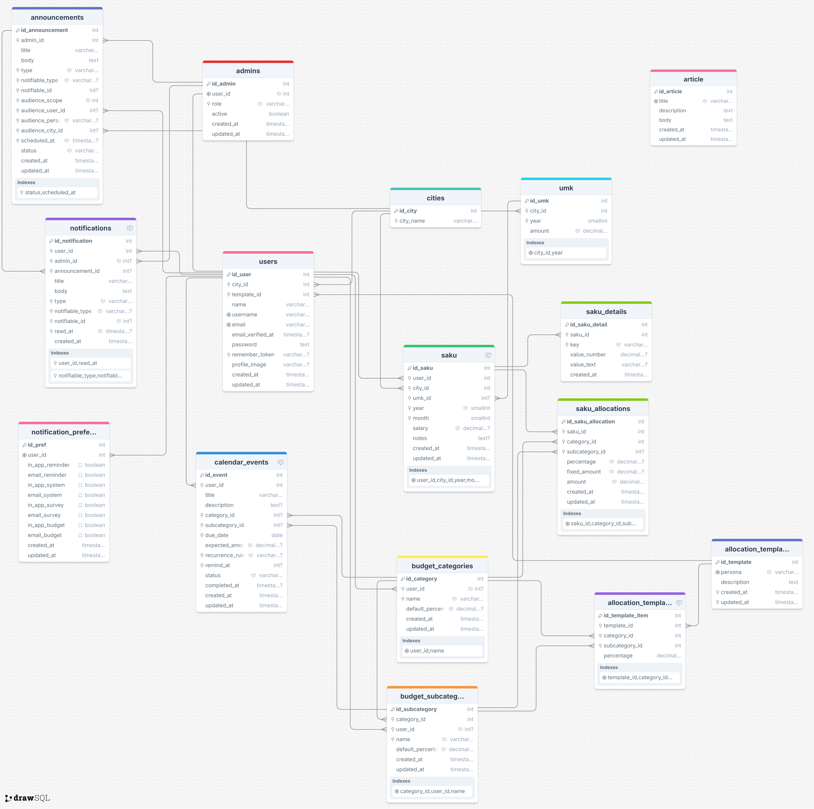

# FinanSaku — Database Schema Overview

This document provides a structured overview of the **FinanSaku PostgreSQL**
database schema managed by Prisma ORM.
It includes all authentication, finance, notification, and admin-related entities.

---

## 1. ERD Diagram



**DrawSQL Links:**

- [FinanSaku v3](https://drawsql.app/teams/doa-1/diagrams/finansaku3)

---

## 2. Core Structure

FinanSaku uses a normalized relational schema.
Each table represents a specific domain and maintains explicit foreign keys.

| Category | Tables |
|-----------|--------|
| **User & Access** | `users`, `admins`, `refresh_tokens`, `notifications`, `notification_preferences` |
| **Location & Reference** | `cities`, `umk` |
| **Finance Core** | `saku`, `saku_allocations`, `saku_details` |
| **Budget System** | `budget_categories`, `budget_subcategories`, `allocation_templates`, `allocation_template_items` |
| **Calendar & Events** | `calendar_events` |
| **Communication** | `announcements`, `notifications` |
| **Content** | `article` |

---

## 3. Entity Relationships (Mermaid)

```mermaid
erDiagram
  User ||--o{ Saku : has
  User ||--o{ RefreshToken : owns
  User ||--o{ Notification : receives
  User ||--o{ BudgetCategory : owns
  User ||--o{ BudgetSubcategory : owns
  User ||--o{ CalendarEvent : creates
  User ||--o| Admin : may_be
  User ||--o| NotificationPreference : defines
  Admin ||--o{ Announcement : creates
  City ||--o{ UMK : defines
  City ||--o{ Saku : influences
  UMK ||--o{ Saku : references
  BudgetCategory ||--o{ BudgetSubcategory : groups
  BudgetCategory ||--o{ SakuAllocation : allocates
  BudgetSubcategory ||--o{ SakuAllocation : allocates
  Saku ||--o{ SakuAllocation : has
  Saku ||--o{ SakuDetail : details
  AllocationTemplate ||--o{ AllocationTemplateItem : contains
  User ||--o| AllocationTemplate : uses
  Announcement ||--o{ Notification : triggers
````

---

## 4. User & Authentication

### 4.1 Users

| Column                     | Type      | Notes                                   |
| -------------------------- | --------- | --------------------------------------- |
| `id_user`                  | UUID      | Primary key                             |
| `city_id`                  | UUID      | FK → `cities.id_city`                   |
| `template_id`              | UUID      | FK → `allocation_templates.id_template` |
| `name`                     | String    | Required                                |
| `username`                 | String    | Unique                                  |
| `email`                    | String    | Unique                                  |
| `provider`                 | String    | `local` or `google`                     |
| `provider_id`              | String    | Unique per provider                     |
| `email_verified_at`        | Timestamp | Set when user verifies email            |
| `password`                 | String    | Nullable for OAuth users                |
| `profile_image`            | String    | Optional profile URL                    |
| `created_at`, `updated_at` | Timestamp | Auditing fields                         |

Relations:

- 1–1 with `notification_preferences`
- 1–N with `saku`, `refresh_tokens`, `budget_categories`, etc.

---

### 4.2 Refresh Tokens

| Column             | Type      | Notes                |
| ------------------ | --------- | -------------------- |
| `id_refresh_token` | UUID      | Primary key          |
| `user_id`          | UUID      | FK → `users.id_user` |
| `token`            | String    | Unique JWT           |
| `is_revoked`       | Boolean   | Defaults to false    |
| `expires_at`       | Timestamp | Expiration timestamp |
| `created_at`       | Timestamp | Creation time        |

Purpose:

- Persist refresh tokens for each login session
- Enables logout and session invalidation logic

---

### 4.3 Admins

| Column                     | Type      | Notes                           |
| -------------------------- | --------- | ------------------------------- |
| `id_admin`                 | UUID      | Primary key                     |
| `user_id`                  | UUID      | FK → `users.id_user`            |
| `role`                     | String    | Role type (`super_admin`, etc.) |
| `active`                   | Boolean   | Admin status                    |
| `created_at`, `updated_at` | Timestamp | Lifecycle tracking              |

---

## 5. Location & Reference

### 5.1 Cities

| Column      | Type                                    | Notes       |
| ----------- | --------------------------------------- | ----------- |
| `id_city`   | UUID                                    | Primary key |
| `city_name` | String                                  | City name   |
| Relations   | `users`, `umk`, `saku`, `announcements` |             |

---

### 5.2 UMK

| Column    | Type          | Notes                 |
| --------- | ------------- | --------------------- |
| `id_umk`  | UUID          | Primary key           |
| `city_id` | UUID          | FK → `cities.id_city` |
| `year`    | Int           | Unique per city       |
| `amount`  | Decimal(12,2) | Annual UMK value      |

---

## 6. Budget System

### 6.1 Allocation Templates

| Table                       | Description                                |
| --------------------------- | ------------------------------------------ |
| `allocation_templates`      | Stores spending persona templates          |
| `allocation_template_items` | Defines ratio per category and subcategory |

Each user can select one base template (`template_id`).

---

### 6.2 Budget Categories and Subcategories

| Table                  | Description                   |
| ---------------------- | ----------------------------- |
| `budget_categories`    | Top-level spending categories |
| `budget_subcategories` | Nested under each category    |

Relations:

- Categories and subcategories link to both templates and user budgets.

---

## 7. Finance Core

### 7.1 Saku (User Wallets)

| Column                     | Type          | Notes                            |
| -------------------------- | ------------- | -------------------------------- |
| `id_saku`                  | UUID          | Primary key                      |
| `user_id`                  | UUID          | FK → `users.id_user`             |
| `city_id`                  | UUID          | FK → `cities.id_city`            |
| `umk_id`                   | UUID          | FK → `umk.id_umk`                |
| `year`, `month`            | Int           | Unique per user-city combination |
| `salary`                   | Decimal(15,2) | Monthly income                   |
| `notes`                    | String        | Optional                         |
| `created_at`, `updated_at` | Timestamp     | Lifecycle fields                 |

---

### 7.2 Saku Allocations

| Column                     | Type          | Notes                                |
| -------------------------- | ------------- | ------------------------------------ |
| `id_saku_allocation`       | UUID          | Primary key                          |
| `saku_id`                  | UUID          | FK → `saku.id_saku`                  |
| `category_id`              | UUID          | FK → `budget_categories.id_category` |
| `subcategory_id`           | UUID          | Nullable FK                          |
| `percentage`               | Decimal(5,2)  | Optional ratio                       |
| `fixed_amount`             | Decimal(15,2) | Optional fixed value                 |
| `amount`                   | Decimal(15,2) | Computed or user input               |
| `created_at`, `updated_at` | Timestamp     | Lifecycle fields                     |

---

### 7.3 Saku Details

| Column           | Type      | Notes               |
| ---------------- | --------- | ------------------- |
| `id_saku_detail` | UUID      | Primary key         |
| `saku_id`        | UUID      | FK → `saku.id_saku` |
| `key`            | String    | Metadata key        |
| `value_number`   | Decimal   | Numeric value       |
| `value_text`     | String    | Optional text       |
| `created_at`     | Timestamp | Creation time       |

---

## 8. Calendar & Notifications

### 8.1 Calendar Events

| Column            | Type    | Notes                                      |
| ----------------- | ------- | ------------------------------------------ |
| `id_event`        | UUID    | Primary key                                |
| `user_id`         | UUID    | FK → `users.id_user`                       |
| `title`           | String  | Event title                                |
| `description`     | String  | Optional                                   |
| `category_id`     | UUID    | FK → `budget_categories.id_category`       |
| `subcategory_id`  | UUID    | FK → `budget_subcategories.id_subcategory` |
| `due_date`        | Date    | Event date                                 |
| `expected_amount` | Decimal | Planned expense                            |
| `status`          | String  | `pending`, `done`, `skipped`               |
| `completed_at`    | Date    | Optional completion time                   |

---

### 8.2 Notifications

| Column            | Type      | Notes                    |
| ----------------- | --------- | ------------------------ |
| `id_notification` | UUID      | Primary key              |
| `user_id`         | UUID      | FK → `users.id_user`     |
| `title`           | String    | Notification title       |
| `body`            | String    | Message content          |
| `type`            | String    | `system`, `budget`, etc. |
| `read_at`         | Timestamp | Nullable                 |
| `created_at`      | Timestamp | Creation time            |

---

### 8.3 Notification Preferences

| Column            | Type    | Notes                         |
| ----------------- | ------- | ----------------------------- |
| `id_pref`         | UUID    | Primary key                   |
| `user_id`         | UUID    | FK → `users.id_user`          |
| `in_app_reminder` | Boolean | Default true                  |
| `email_reminder`  | Boolean | Default false                 |
| Other flags       | Boolean | Toggles per notification type |

---

## 9. Announcements & Content

### 9.1 Announcements

| Column            | Type      | Notes                                     |
| ----------------- | --------- | ----------------------------------------- |
| `id_announcement` | UUID      | Primary key                               |
| `admin_id`        | UUID      | FK → `admins.id_admin`                    |
| `title`, `body`   | String    | Content fields                            |
| `type`            | String    | `system`, `budget`, `survey`              |
| `audience_scope`  | String    | `all`, `by_user`, `by_persona`, `by_city` |
| `status`          | String    | `draft`, `scheduled`, `sent`, `cancelled` |
| `scheduled_at`    | Timestamp | Optional time                             |

---

### 9.2 Articles

| Column                     | Type      | Notes                      |
| -------------------------- | --------- | -------------------------- |
| `id_article`               | Int       | Auto-increment primary key |
| `title`                    | String    | Unique                     |
| `description`              | Text      | Short summary              |
| `body`                     | Text      | Full content               |
| `created_at`, `updated_at` | Timestamp | Standard auditing          |

---

## 10. Validation Rules

Manual constraints are defined in `docs/db_constraints.sql` for stricter validation, e.g.:

```sql
ALTER TABLE "umk"
ADD CONSTRAINT check_umk_amount_nonnegative
CHECK (amount >= 0);

ALTER TABLE "saku_allocations"
ADD CONSTRAINT check_saku_allocations_percentage_valid
CHECK (percentage IS NULL OR (percentage >= 0 AND percentage <= 100));
```

---

## 11. Notes

- Prisma maps camelCase to snake_case using `@map()` annotations.
- UUIDs are default primary keys for all entities except `article`.
- Foreign key indices are defined for all relation fields.
- All timestamps use UTC by default.
- `remember_token` is retained only for backward compatibility.
